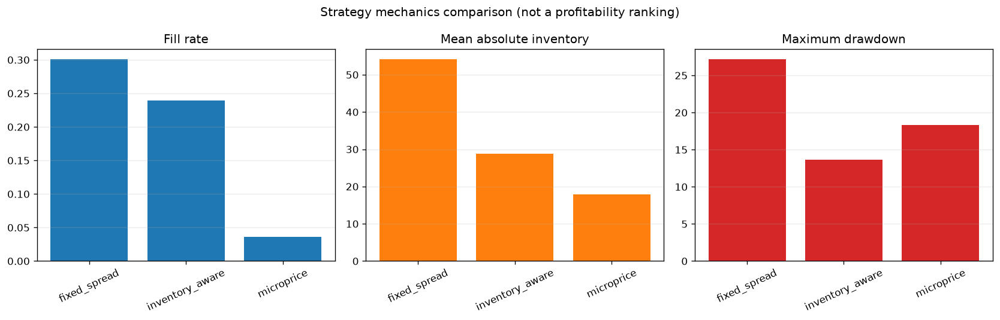
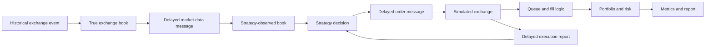

# lob-market-maker

A deterministic, event-driven Level 2 limit-order-book market-making research
simulator for Python 3.12+.

This repository is an independent portfolio project focused on market
microstructure, latency, queue-aware fills, accounting, and reproducible
evaluation. It is a historical research simulator—not a live trading system.
It contains no broker/exchange connectivity, credentials, real-money order
submission, or live-feed code.

Synthetic outputs are functional demonstrations. They are not evidence that a
strategy is profitable in real markets.

[Read the curated case study](docs/CASE_STUDY.md), which deliberately emphasizes
inventory, execution, risk, and sensitivity rather than synthetic profit.



## What it demonstrates

- Aggregated bid/ask reconstruction with integer price ticks
- Canonical CSV and Parquet Level 2 data
- Tardis incremental-L2/trade and LOBSTER message/order-book adapters
- Cryptographic dataset manifests and explicit synthetic/historical provenance
- Deterministic synthetic depth, spread, volatility, and order-flow regimes
- Strict and diagnostic lenient validation modes with hash-bound certificates
- A true exchange book distinct from a delayed strategy-observed book
- Causal same-timestamp ordering and fixed or seeded-jitter latency
- Marketable limits, passive orders, partial fills, cancels, expiry, and audit
- A shared FIFO Level 2 queue overlay with three cancellation assumptions
- Maker fees/rebates, taker fees, exact tick-notional accounting, and P&L
- Projected inventory/open-order limits, exact quote-age cancels,
  loss/drawdown limits, and kill switch
- Rejection backoff, rate-aware suppression, and separate intent/sent counters
- Fixed-spread, inventory-aware, and microprice/order-flow quoting
- Side-adjusted 100 ms, 1 s, and 5 s markouts using true future states ex post
- Latency/queue/fee/ablation experiments with hashed input-stream manifests
- Hashed run identity, guarded comparisons, structured reports, and a
  repeated full-loop benchmark
- Cached top-of-book lookup and a deterministic live-order index, both checked
  against reference behavior
- Typed code, invariant/property tests, a golden path, Ruff, mypy, and CI

## Architecture



At no point does strategy code receive the true book, true future market state,
or undelivered true inventory. Markouts are computed only after replay.

The scheduler key is
`(timestamp_ns, causal_wave, phase, source_sequence, schedule_id)`. Historical
market activity wins over an order or cancel arriving at the same timestamp.
A zero-latency reaction moves into a later causal wave, so it cannot jump back
ahead of the event that caused it.

More detail: [architecture](docs/architecture.md),
[methodology](docs/methodology.md), [assumptions](docs/assumptions.md), and
[measured performance](docs/performance.md).

## Installation

From the repository root:

```bash
python -m venv .venv
# Windows PowerShell: .\.venv\Scripts\Activate.ps1
# macOS/Linux: source .venv/bin/activate
python -m pip install -e ".[dev]"
```

The package name is `lobmm`; the distribution name is `lob-market-maker`.

## Quick start

Run the complete demonstration, sensitivity grid, and curated case study:

```bash
python -m lobmm.cli demo --publish-case-study
```

The individual steps are available when investigating one stage.

Generate the deterministic demonstration stream:

```bash
python -m lobmm.cli generate-synthetic \
  --config configs/synthetic.yaml \
  --output data/processed/synthetic.parquet
```

Validate schema, chronology, quantities, and reconstructed-book invariants:

```bash
python -m lobmm.cli validate-data \
  --input data/processed/synthetic.parquet
```

Run all three strategies on that same event file:

```bash
python -m lobmm.cli backtest \
  --config configs/fixed_spread.yaml \
  --run-name fixed-spread-demo

python -m lobmm.cli backtest \
  --config configs/inventory_aware.yaml \
  --run-name inventory-demo

python -m lobmm.cli backtest \
  --config configs/microprice.yaml \
  --run-name microprice-demo
```

Compare completed runs and regenerate a report:

```bash
python -m lobmm.cli compare \
  runs/fixed-spread-demo \
  runs/inventory-demo \
  runs/microprice-demo

python -m lobmm.cli report \
  --run runs/microprice-demo
```

Run a genuine latency and queue-model sensitivity grid:

```bash
python -m lobmm.cli experiment \
  --config configs/microprice.yaml \
  --name microprice-sensitivity
```

The short demo path does not separate cancellation policies. A
[controlled replay and independent artifact audit](docs/QUEUE_CANCELLATION.md)
verifies 0/5/10-unit fills per side under back/pro-rata/front cancellation,
positive latency, and nonzero fees and rebates:

```bash
python -m lobmm.cli experiment --config configs/queue_cancellation.yaml \
  --name queue-cancellation --latency-multipliers 0.5,1,2
python -m lobmm.cli audit-queue-study --experiment experiments/queue-cancellation \
  --config configs/queue_cancellation.yaml --output docs/QUEUE_CANCELLATION.md
```

The auditor is specific to the versioned witness and rejects changed input,
configuration, or inconsistent artifacts before publishing its Markdown/JSON
report. See the report for accounting identities and limitations.

The separately versioned [latency-boundary and partial-fill stress suite](docs/LATENCY_STRESS_V1.md)
holds market-data latency at 100 us while sweeping command arrival 1 ns before,
at, and after historical events. Fifty scenarios check independent fill/cash
oracles, event-time snapshots, delayed reports, split fills and residual marks:

```bash
python -m pytest tests/integration/test_latency_stress_v1.py -q \
  --latency-study-output experiments/latency-stress-v1
```

CI retains each tape/config, replay tables, scheduler snapshots and the hashed
JSON audit as a `latency-stress-v1-<commit>` artifact.

The [reservation-to-close exposure study](docs/EXPOSURE_SESSION_STRESS_V1.md)
audits 27 full replays through partial fills, cancel races, delayed knowledge,
loss shutdown and partial session liquidation. Independent reservation and
rational cost-pool oracles accompany minimal conservative-mark and aggregate
reduce-only admission fixes. It distinguishes hard position caps from loss
thresholds, residual marks and forced session expiry.

```bash
python -m pytest tests/integration/test_exposure_session_stress_v1.py -q \
  --exposure-study-output experiments/exposure-session-stress-v1
python tools/reproduce_exposure_defects.py
```

Measure the readable reference book or the complete causal event loop:

```bash
python -m lobmm.cli benchmark \
  --config configs/benchmark.yaml

python -m lobmm.cli benchmark-full \
  --config configs/benchmark.yaml \
  --event-count 20000 \
  --repeats 5
```

The first command is a profiled/traced reference-book replay. The second is the
repeated, unprofiled scheduler/exchange/strategy loop with a separate memory
pass. See [measured performance](docs/performance.md) before quoting either.

Every command supports `--help` and exits nonzero on invalid input.

## Canonical data format

| Column | Type | Contract |
|---|---|---|
| `timestamp_ns` | `int64` | Nonnegative exchange timestamp |
| `sequence_number` | `int64` | Strictly increasing deterministic feed order |
| `event_type` | string | `ADD`, `CANCEL`, `TRADE`, `RESET`, `SNAPSHOT` |
| `side` | `int8`, nullable | Resting side: `BID=+1`, `ASK=-1` |
| `price_ticks` | `int64` | Positive except `RESET=0` |
| `quantity` | `int64` | Positive except `RESET=0` |

Side means resting liquidity for every event. A `TRADE` with `side=+1` consumed
the bid and was initiated by an aggressive seller. Adapters normalize a modify
to cancel/add unless venue-specific evidence justifies another treatment.

All matching and book keys use integer ticks. For a configured tick size of
`0.01`, `price_ticks=10025` displays as `100.25`; floats are not matching keys.

The project never downloads or redistributes licensed market data. Additional
sources can implement `BaseL2DataAdapter`/`L2DataAdapter`, map source fields and
side semantics, write canonical Parquet, and validate it before replay.

## Real-data ingestion

Two concrete adapters are included:

- `ingest-tardis` converts normalized `incremental_book_L2` and optional trade
  files, reconciling prints with displayed reductions so depth is not consumed
  twice.
- `ingest-lobster` converts paired message/order-book files, including exact
  session timestamps, finite-window reconciliation, and halt handling.

Both commands write canonical Parquet plus a sidecar containing source-file and
output SHA-256 hashes, adapter parameters, diagnostics, licensing notes, and
validated dataset provenance. Backtests verify a configured historical
checksum before decoding the file.

```bash
python -m lobmm.cli ingest-tardis --help
python -m lobmm.cli ingest-lobster --help
```

See [real-data adapter methodology](docs/data_adapters.md). Raw vendor files
remain outside the repository.

## Configuration

YAML is validated with Pydantic and rejects unknown fields. Sections cover
instrument, data, synthetic generation, latency, exchange, queue model,
fees/rebates, strategy, risk, backtest, metrics, output, and seed.

Example:

```yaml
instrument:
  symbol: SYNTH
  tick_size: "0.01"
  lot_size: 1
latency:
  market_data_ns: 100000
  order_entry_ns: 150000
  cancellation_ns: 150000
  fill_report_ns: 100000
queue_model:
  cancellation_allocation: back_of_queue
fees:
  maker_rebate_per_unit: "0.0002"
  taker_fee_per_unit: "0.0003"
risk:
  max_abs_inventory: 100
  max_order_size: 25
strategy:
  name: microprice
  order_size: 10
  post_only: true
random_seed: 7
```

Latency fields are nanoseconds for ordering and modelling. They do not imply
that Python code or a deployment operates at nanosecond speed.

Historical price-through fills are a queue-model rule, not an exchange toggle.
`backtest.mark_price` chooses midpoint, microprice, or conservative marking;
`metrics.near_limit_fraction` defines the reported near-inventory-limit band.
The session-end policy is either `mark` or `liquidate`.

## Queue and fill model

The true L2 book stores external aggregate depth. Own passive orders live in a
separate queue overlay. Each active side/price has one shared FIFO sequence of
external and own segments:

```text
external depth at arrival -> own order A -> later external add -> own order B
```

A trade has one volume budget and walks that sequence once, preventing the same
trade from filling several orders independently. Queue ahead is derived from
segments before an order. Later adds are behind it. Exact-position
cancellations are not observable in L2, so the simulator offers:

- `back_of_queue`: cancel volume behind us first (conservative baseline);
- `pro_rata`: allocate by estimated external segment size;
- `front_of_queue`: cancel volume ahead first (optimistic sensitivity).

A historical trade through a better resting own price is assumed to sweep that
order. See [queue model](docs/queue_model.md) for worked examples and the
important counterfactual limitations.

## Strategies

All strategies share one quote manager with minimum lifetime, refresh/stale
timers, price and quantity thresholds, exactly one managed quote per side,
post-only behavior, and risk suppression.

### Fixed-spread baseline

```text
fair_value = observed midpoint
bid = floor(fair_value - half_spread)
ask = ceil(fair_value + half_spread)
```

This is the principal benchmark.

### Inventory-aware

```text
normalized_inventory = known_inventory / position_limit
reservation = midpoint - inventory_penalty * normalized_inventory
```

Long inventory moves both desired prices down and tapers size, encouraging
selling and discouraging additional buying; short inventory does the opposite.

### Microprice and order flow

```text
imbalance = (bid_qty - ask_qty) / (bid_qty + ask_qty)
microprice = (ask * bid_qty + bid * ask_qty) / (bid_qty + ask_qty)
reservation = microprice
              + imbalance_coefficient * imbalance
              - inventory_penalty * normalized_inventory
half_spread = max(minimum, base + volatility_multiplier * recent_volatility)
```

Volatility is rolling and backward-looking on delivered midpoint observations.
This is an interpretable research rule, not a claim of universal optimality.

## Accounting

Buy fills increase inventory and reduce trade cash; sells do the reverse.
Positive fees are costs and positive rebates are income:

```text
gross_pnl = trade_cash + inventory * mark
net_pnl = gross_pnl - fees + rebates
```

The default research mark is midpoint. Average-cost realized/unrealized P&L,
cash/mark equity, order quantity identity, and cost signs are tested. Midpoint
marking can overstate liquidation value during wide or thin markets.

## Run artifacts

Each run directory contains:

```text
run_config.yaml
summary.json
metrics.json
diagnostics.json
orders.parquet
fills.parquet
inventory.parquet
pnl.parquet
quotes.parquet
risk_events.parquet
market.parquet
markouts.parquet
plots/
```

Order rows preserve state transitions. Fill rows preserve decision, send,
arrival, fill, and notification time. Reports include activity, P&L, inventory,
market conditions, execution quality, markouts, risk, approximate attribution,
and measured engineering statistics. Summary/diagnostic artifacts also preserve
dataset provenance, input-validation diagnostics, and an exact event-stream
SHA-256; comparisons reject mismatched streams.

Annualized Sharpe is deliberately omitted for the small event-time
demonstration because a defensible sampling/annualization convention is not
available.

## Testing and quality

```bash
python -m ruff check .
python -m ruff format --check .
python -m mypy src/lobmm
python -m pytest -q
python -m pytest --cov=lobmm --cov-report=term-missing
```

Tests cover book mechanics, event/schema validation, all queue-cancellation
models, multiple own orders, latency ordering, lifecycle transitions,
marketable and passive fills, accounting identities, risk, strategy knowledge,
markout signs, deterministic seeds, end-to-end artifacts, and a manually
auditable golden path. Hypothesis tests exercise core invariants.
The version 0.2 release gate passed 250 tests with 90.64% branch-aware
whole-package coverage on 2026-07-27.

## Demonstration notebook

After running all three configurations, open
`notebooks/01_demo_analysis.ipynb`. It imports `lobmm` outputs; it does not
duplicate the matching engine.

For a reviewer-friendly result that requires no notebook execution, see the
[curated case study](docs/CASE_STUDY.md).

## Limitations and responsible interpretation

The most important limits are:

- Level 2 data cannot reveal exact individual queue position or cancellation
  ownership.
- Historical replay cannot model how the market would react to our orders.
- Large simulated orders undermine the no-market-impact assumption.
- Marketable execution against recorded depth is approximate.
- Results are sensitive to latency, costs, queue assumptions, venue rules, and
  data quality.
- Synthetic data is not proof of profitability.
- Past backtest performance does not guarantee future results.

Read the full [limitations](docs/limitations.md) before interpreting a run.

## Roadmap

Next research steps:

1. Run the included adapters on legally obtained multi-session data and retain
   chronological train/validation/test splits.
2. Calibrate latency, fees, and queue sensitivity from measured venue/feed
   data.
3. Add venue-specific sessions, priority, auction, and exceptional-event rules.
4. Profile the complete event loop on a million-plus-event real stream.
5. Evaluate a separate array/sorted-book path only with event-by-event
   equivalence tests; the readable path already caches top prices and indexes
   live orders.
6. Evaluate Level 3 data where licensing and storage permit.

Live trading and automatic order submission are not roadmap items for this
research repository.
