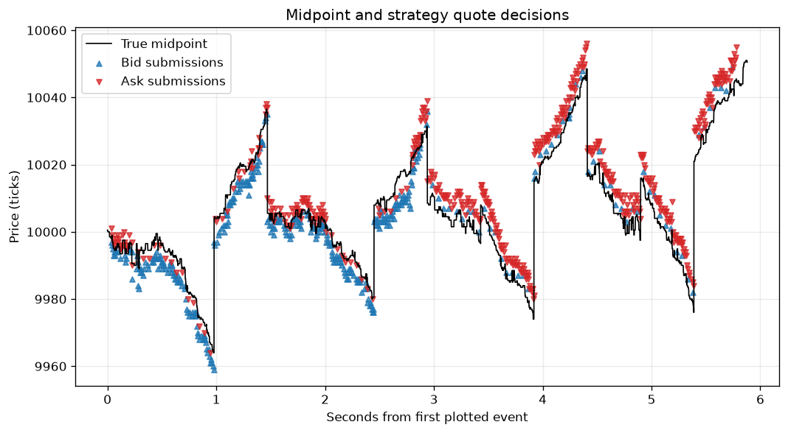
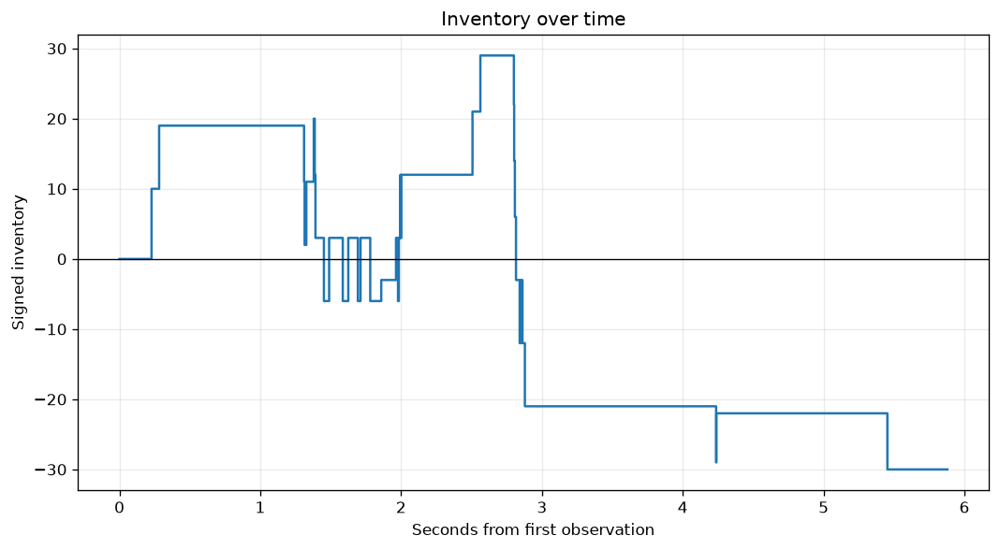
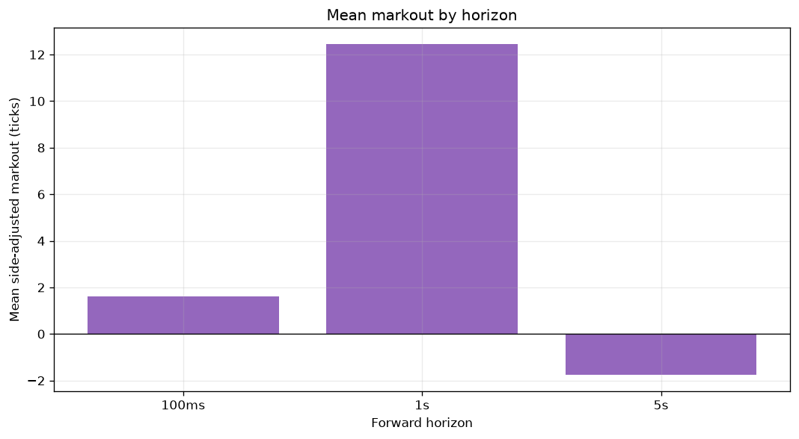
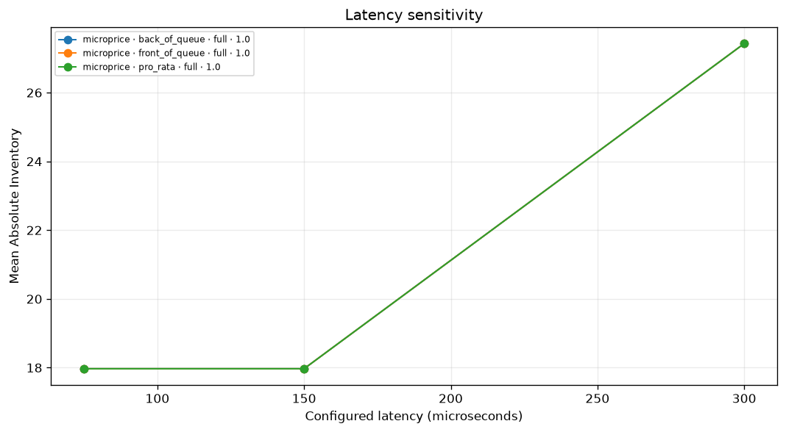
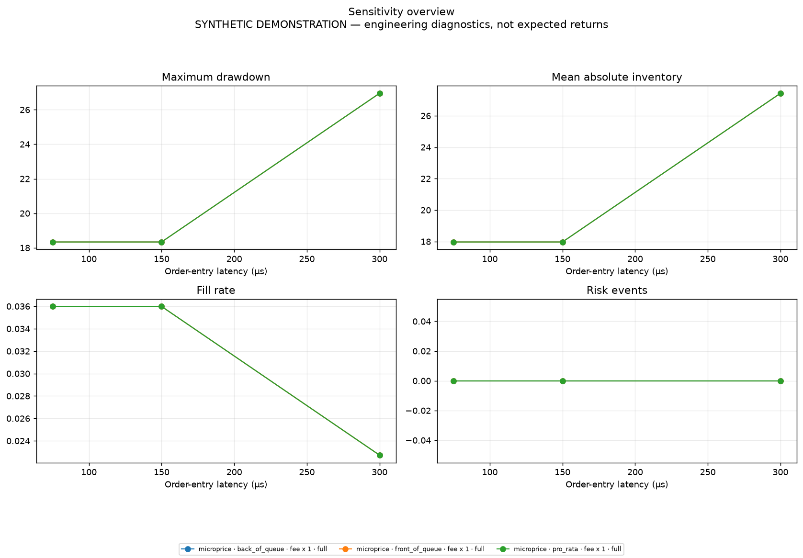

# Market-making simulator case study

> **SYNTHETIC DEMONSTRATION.** This study demonstrates simulator mechanics and controlled sensitivity. It is not evidence of expected market profitability.

The same canonical Level 2 stream is replayed through fixed-spread, inventory-aware, and microprice quoting. The strategy sees only delayed market data and delayed execution reports; future states are used only for post-run markouts.

## Mechanics comparison

| Strategy | Fills | Fill rate | Mean abs. inventory | Near limit | Max drawdown | Risk blocks | Venue rejects | Scheduler/market event |
|---|---:|---:|---:|---:|---:|---:|---:|---:|
| fixed_spread | 365 | 0.301 | 54.15 | 26.0% | 27.18 | 26 | 8 | 4.17 |
| inventory_aware | 314 | 0.239 | 28.83 | 0.0% | 13.68 | 0 | 26 | 4.24 |
| microprice | 35 | 0.036 | 17.97 | 0.0% | 18.34 | 0 | 95 | 3.98 |

Synthetic P&L is intentionally not used to rank the strategies. Inventory behavior, execution activity, risk interventions, and sensitivity are the meaningful outputs here.


## Delayed quotes and inventory





## Execution quality and model sensitivity





Across this grid, moving from 0.5x to 2x configured latency changed mean absolute inventory from 17.97 to 27.43 and fill rate from 0.036 to 0.023. The queue-allocation policies produced identical recorded metrics on this short path, so this demonstration does not discriminate among them.

- Experiment cases: **9**
- Canonical event-stream SHA-256: `1e910893059341fc01c740a3ada61ba3dcf0df30a2663150d868d6e12babd0bc`



## Controlled cancellation-policy validation

A separate [controlled end-to-end replay](QUEUE_CANCELLATION.md) uses the canonical own-10/add-50/cancel-60/trade-65 fixture to discriminate the three policies on both sides with positive latency and audited fee/cash accounting. Reproduce and verify that witness using the commands in its report.

## Reproduce

```bash
python -m lobmm.cli demo --publish-case-study
```

Bulk run data remains ignored because it is reproducible. This page and its curated images are the small reviewable artifacts intended for the repository.
