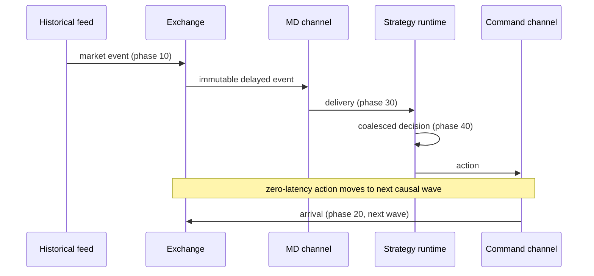
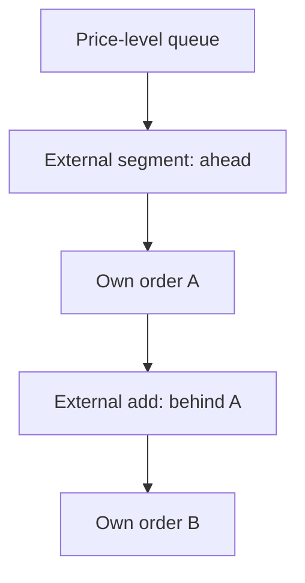
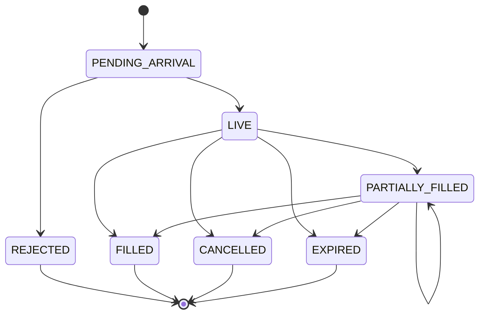

# Architecture

## Event flow


The backtest orchestrator wires components but does not expose exchange-owned
objects to strategies.

## Ownership boundaries

| Boundary | Owns | May expose |
|---|---|---|
| Data layer | Canonical immutable events and schemas | Ordered event iterator |
| Scheduler | Clock, heap, causal waves, monotonic schedule IDs | Event payloads to registered handlers |
| Exchange | True L2 book, live orders, queue overlay, transitions | Immutable reports and audit rows |
| Strategy runtime | Observed L2 book, known account, shadow orders | Frozen strategy context |
| Portfolio | True cash, inventory, average cost, costs, marks | Immutable accounting snapshots |
| Risk | Limits, kill-switch state, rejection audit | Decisions and cancel requests |
| Strategy | Its signal history and quote intent | Actions only |
| Evaluation | Completed audit, true future marks | Post-run metrics and artifacts |

`metrics` and markout functions consume completed results. They are not
dependencies of strategy modules.

## Deterministic scheduler

Every item is ordered by:

```text
(timestamp_ns, causal_wave, phase, source_sequence, schedule_id)
```



Phases are stable integers, source sequence preserves channel order, and a
monotonic schedule ID breaks every remaining tie. Scheduling at the current
time into a phase that has already started increments the wave. A finite wave
guard detects immediate-response loops.

## Book and queue separation

The true book is the historical aggregated external book. Simulated resting
orders are not inserted into its price dictionaries; they live in a queue
overlay keyed by `(side, price_ticks)`.



An exact-price trade supplies one mutable volume budget and walks this sequence
once. Cancellation models reduce external nodes only. Queue-ahead and
behind-volume are derived by scanning nodes around the requested order, which
also handles multiple own orders without reusing trade quantity.

The external book and overlay are re-anchored on reset/snapshot. Their
counterfactual limitations are documented and surfaced in diagnostics.

## Data and command channels

A latency model returns a deterministic nonnegative delay from its own seeded
generator. Each channel stores its last delivery timestamp and clamps the next
delivery time to avoid reordering messages. Payloads are frozen values:

- market channel: original `MarketEvent`;
- command channel: immutable new/cancel request plus decision/send metadata;
- report channel: immutable acknowledgement, rejection, cancellation, expiry,
  or fill report.

A delayed market message never carries a reference to the mutable true book.

## Order lifecycle



The exchange is authoritative. Strategy `pending_cancel` state does not alter
exchange fill eligibility. Every transition and fill has a unique deterministic
ID and is appended to the audit trail.

## Accounting path

At exchange fill time:

1. order remaining quantity and cumulative notional update;
2. fee/rebate economics are calculated from liquidity role;
3. portfolio books signed inventory and trade cash;
4. realized average-cost P&L updates;
5. gross/net mark identities are checked;
6. an immutable fill report is delayed to the strategy.

The strategy-known account changes only at step 6.

## Package dependency direction

```text
enums/types/events/config
        ↓
data ─ book ─ orders ─ scheduler/channels
        ↓        ↓             ↓
     queue_model ───────── exchange
                         ↓
                 portfolio/risk
                         ↓
              strategy_runtime/strategies
                         ↓
                     backtest
                         ↓
               metrics/report/cli
```

Lower layers never import strategy, reporting, or CLI modules. Core logic does
not depend on notebooks.

## Failure behavior and audit

- Invalid configuration or canonical data fails before replay.
- Strict book errors are descriptive; lenient clamping increments named
  counters and logs context.
- Risk rejections, stale cancels, post-only rejects, malformed historical
  reductions, reset behavior, and missing future marks are auditable.
- CLI commands convert failures to helpful messages and nonzero exit codes.
- Generated outputs are written beneath the configured run directory; large
  run artifacts and raw data are ignored by version control.
